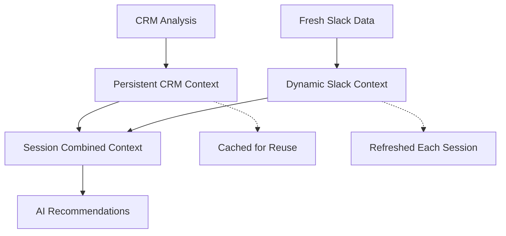

# Session-Based Context Architecture

## 🧠 **Architecture Overview**

The HeyJarvis system now implements a sophisticated session-based context architecture that separates persistent business intelligence from dynamic team workflow data.

### **Core Concept**

```
Persistent CRM Context + Dynamic Slack Context = Ultimate Business Intelligence
```

## 🏗️ **Architecture Components**

### **1. Persistent CRM Context**
- **Purpose**: Foundational business intelligence that remains stable
- **Scope**: Per organization
- **Lifecycle**: Generated once, cached and reused across all chat sessions
- **Content**: HubSpot analysis, deals, patterns, business recommendations
- **Storage**: `persistentContexts` Map in `ContextBridge`

### **2. Dynamic Slack Context**
- **Purpose**: Real-time team activity and workflow insights
- **Scope**: Per chat session
- **Lifecycle**: Refreshed with each new chat interaction
- **Content**: Live Slack messages, team requests, process discussions
- **Storage**: `dynamicContexts` Map in `ContextBridge`

### **3. Session Context**
- **Purpose**: Combined intelligence for specific chat sessions
- **Scope**: Per organization + session ID
- **Lifecycle**: Created by combining persistent CRM + fresh Slack data
- **Content**: Ultimate business context for AI recommendations
- **Storage**: `sessionContexts` Map in `ContextBridge`

## 🔄 **Workflow**

### **Initial Setup (One-Time per Organization)**
```javascript
// Initialize persistent CRM context
const system = new UltimateContextSystem();
const result = await system.initializePersistentCRMContext(
  websiteUrl, 
  crmConfig, 
  organizationId
);
```

### **Chat Session Processing (Per Conversation)**
```javascript
// Process session with fresh Slack data
const sessionResult = await system.processSessionWithFreshSlack(
  organizationId,
  sessionId,
  freshSlackWorkflows  // Latest data from your Slack bot
);

// Generate recommendations using combined context
const recommendations = await system.generateIntelligentRecommendations(
  organizationId,
  userQuery,
  sessionId
);
```

## 📊 **Data Flow**



## 🚀 **Implementation Details**

### **ContextBridge Methods**

#### Persistent Context
- `convertCRMToPersistentContext(crmAnalysis, organizationId)`
- Stores in `persistentContexts` Map
- Reused across all sessions for the organization

#### Dynamic Context
- `convertSlackToDynamicContext(slackWorkflows, organizationId, sessionId)`
- `refreshSlackContext(freshSlackWorkflows, organizationId, sessionId)`
- Stores in `dynamicContexts` Map with session-specific keys

#### Session Context
- `combineContextsForSession(organizationId, sessionId)`
- `getUltimateContextForSession(organizationId, sessionId)`
- `generateRecommendationsForSession(organizationId, userQuery, sessionId)`

### **UltimateContextSystem Methods**

#### Setup
- `initializePersistentCRMContext(websiteUrl, crmConfig, organizationId)`
- One-time setup per organization

#### Session Processing
- `processSessionWithFreshSlack(organizationId, sessionId, freshSlackWorkflows)`
- Called for each new chat session

#### Recommendations
- `generateIntelligentRecommendations(organizationId, userQuery, sessionId)`
- Uses session-specific combined context

## 🖥️ **Electron Integration**

### **Main Process (UltimateContextManager)**
```javascript
// Initialize persistent context
await contextManager.initialize(organizationId, crmConfig);

// Process chat session
await contextManager.processSession(organizationId, sessionId, freshSlackData);

// Generate recommendations
await contextManager.generateRecommendations(organizationId, query, sessionId);
```

### **IPC Handlers**
- `ultimate-context:initialize` - Setup persistent CRM context
- `ultimate-context:process-session` - Process session with fresh Slack data
- `ultimate-context:generate-recommendations` - Generate session-specific recommendations

### **Renderer Process API**
```javascript
// Initialize organization context (one-time)
await window.electronAPI.ultimateContext.initialize(orgId, crmConfig);

// Process new chat session
await window.electronAPI.ultimateContext.processSession(orgId, sessionId, slackData);

// Get recommendations
await window.electronAPI.ultimateContext.generateRecommendations(orgId, query, sessionId);
```

## 💡 **Benefits**

### **Performance**
- CRM analysis runs once per organization, not per chat
- Faster session processing with cached persistent context
- Efficient memory usage with session-specific dynamic data

### **Accuracy**
- Stable business foundation (CRM) + current team state (Slack)
- Context-aware recommendations based on both historical and real-time data
- Session isolation prevents context bleeding between conversations

### **Scalability**
- Support multiple concurrent chat sessions per organization
- Independent session contexts don't interfere with each other
- Efficient caching and cleanup of session data

## 🧪 **Testing**

### **Test Session-Based Architecture**
```bash
npm run test:session-context
```

This test demonstrates:
- Persistent CRM context initialization
- Multiple chat sessions with different Slack data
- Session-specific recommendations
- Context isolation between sessions

### **Test Files**
- `test-session-based-context.js` - Full session architecture test
- `test-ultimate-context-simple.js` - Simplified test for rate limit management

## 🔧 **Configuration**

### **Environment Variables**
```bash
ANTHROPIC_API_KEY=your_anthropic_key
HUBSPOT_API_KEY=your_hubspot_key
SLACK_BOT_TOKEN=your_slack_token
```

### **Session Management**
- Session IDs can be any string (e.g., `chat_session_1`, `user_123_morning`)
- Default session ID is `'default'` if not specified
- Sessions are automatically cleaned up when no longer referenced

## 🎯 **Use Cases**

### **Morning Standup Chat**
- Persistent CRM: Company's sales pipeline status
- Dynamic Slack: Team discussing today's priorities
- Combined: Recommendations for sales focus areas

### **Process Improvement Discussion**
- Persistent CRM: Historical workflow inefficiencies
- Dynamic Slack: Current team complaints about manual processes
- Combined: Specific automation tool recommendations

### **Client Meeting Prep**
- Persistent CRM: Client relationship history and deal status
- Dynamic Slack: Recent team discussions about client needs
- Combined: Meeting agenda and talking points

## 🚀 **Next Steps**

1. **Real Slack Integration**: Connect to your live Slack bot data capture
2. **Session Cleanup**: Implement automatic cleanup of old session contexts
3. **Context Versioning**: Track context changes over time
4. **Multi-Organization**: Support multiple organizations in single Electron app
5. **Context Analytics**: Track which contexts lead to best recommendations
